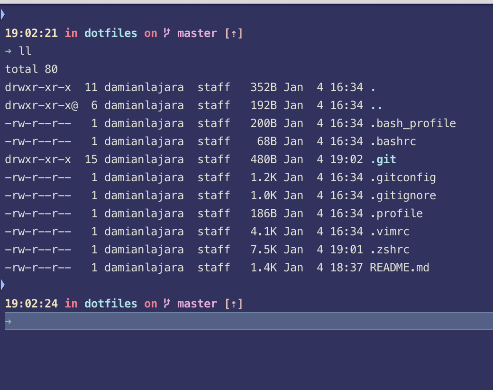

# Dotfiles
Big configurations come in small packages :D

## Steps to config
* Clone and extract files into your home dir (NOTE - I usually just use the `.zshrc` file from here since the other files are pretty out of date)
* Download iterm2
* Install Zsh (Check with zsh --version since you probably already have it :p)
* Install [Oh-My-Zsh](https://github.com/robbyrussell/oh-my-zsh)
* Download all these [iTerm themes](https://github.com/mbadolato/iTerm2-Color-Schemes). You can never go wrong with more style!
  My personal favs are:
  - chalkboard
  - mirage
  - Vaughn (The one I usually go for)
  - wild cherry
  - Obsidian
  - jubi
  - rebecca
* Install all these [fonts](https://github.com/powerline/fonts) on your system. My favorite to use is Meslo
* Go to your iTerm font settings and make sure you change the font (both regular and non-ascii) to your new powerline font of choice
* Go to your iTerm color/theme settings and import all of the themes you just downloaded
* Install [Dank Mono](https://dank.sh/) (Best Font for Coding :D)
* Install VS Code
  * Install [Settings Sync](https://github.com/shanalikhan/code-settings-sync) plugin (Make sure to use secret key and gist id).
  * **Note - As of Jan 2021, VS Code now has built in settings sync. Although it is experimental for now.**
  * [Optional] Download and run this [script](https://github.com/damianlajara/install_vscode_extensions) if extensions did not install with the above

And you're done!

Here is an example of how it will look like:

